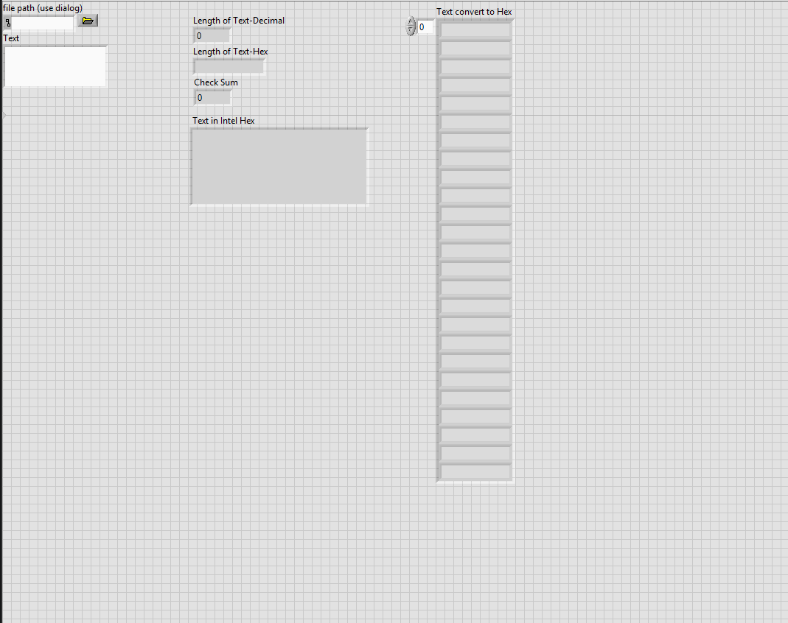
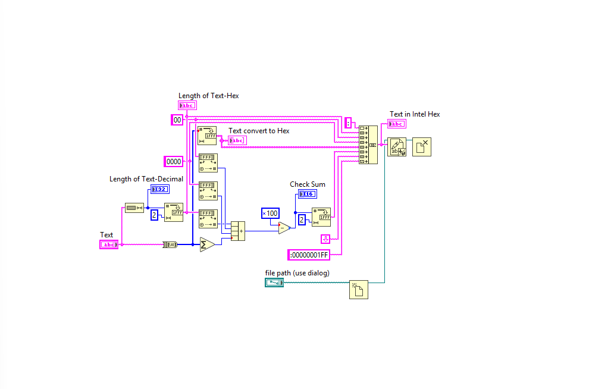

# LabVIEW HEX Data Conversion VI

A small NI LabVIEW utility that takes input data from the front panel and displays it in hexadecimal format. The VI is focused on data representation, input/output handling and basic debugging/validation workflows in LabVIEW.

## What It Does

- Accepts input through LabVIEW front panel controls
- Converts and displays text/data values in hexadecimal format
- Shows text length values and a checksum field
- Displays an Intel HEX-style output area
- Can be used as a small utility for testing, debugging or understanding data representation

## Screenshots

### Front Panel



### Block Diagram



## How To Run

1. Open NI LabVIEW.
2. Open `src/HEX.vi`.
3. Run the VI and provide input values through the front panel controls.
4. Observe the hexadecimal output and related fields.

## Requirements

- NI LabVIEW

## Technologies Used

- NI LabVIEW
- LabVIEW Virtual Instrument (`.vi`)
- hexadecimal data representation
- basic input/output handling
- simple checksum/data validation logic

## Repository Structure

```text
LabVIEW-HEX-Data-Conversion-VI/
├── README.md
├── .gitignore
├── src/
│   └── HEX.vi
└── docs/
    └── screenshots/
        ├── front_panel.png
        └── block_diagram.png
```

## What I Learned

- How to create and organize a simple LabVIEW VI.
- How to handle input and output values through a LabVIEW front panel.
- How hexadecimal representation can help inspect or debug data.
- How to structure a small LabVIEW project for a public engineering portfolio.
- How LabVIEW visual programming can support data-handling and validation tasks.

## Possible Improvements

- Add a short usage example with sample input and expected output.
- Add clearer labels or comments inside the block diagram.
- Add validation cases that show expected hexadecimal results.
- Expand the VI to support more input formats if needed.

## Context

Developed while learning LabVIEW data handling and debugging workflows. These LabVIEW fundamentals are related to skills I later applied during my internship at Benchmark Electronics, where I built a driver for the QL TTI 355 programmable power supply.

## Notes

This repository contains only educational/demo material. It does not include confidential company data, proprietary test procedures or production workflow documentation.
